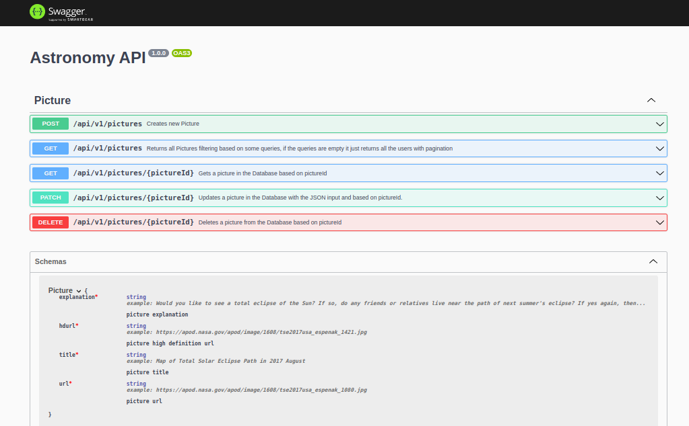

# RESTful_API_Astronomy_Pictures
RESTful API for the input of Astronomy pictures

- Each entry must have the fields "explanation", "hdurl", "title" and "url"
- The API must be able to return data in the JSON format
- The API should provide filter capabilities for all endpoints that return a list of elements, as well should be able to support pagination
- Populate the data with at least 100 images from the Nasa APOD database

## Steps to run it in Local
This API was made using Node.js, Express and MongoDB, so the first steps to run in local would be to check for those programs in the machine. The API also uses the MongoDB Atlas cloud service, is your choice, use the Database in the cloud or in local, look for the commented lines in the file src/database/Picture.js. 
Install the `npm` program in local to install all the dependencies.

### 1. Run the dependencies
Use the npm package manager to run all the dependencies and devDependencies for the API to work. You could install them with one command all at once:
`npm install --include dev`
Or one by one, searching for them in the file `package.json`.

### 2. Start the app
To start the listening for requests and fill up with the local database with some data from the NASA APOD database, use `nodemon src/index.js` if or `npm run dev`, if nodemon was installed, as it is a devDependency, with nodemon the application restarts automatically. If not, use `node src/index.js` but the application has to be restarted manually.

### Valid endpoints to execute CRUD operations
- POST /api/v1/pictures
- GET  /api/v1/pictures
- GET  /api/v1/pictures/{pictureId}
- PATCH /api/v1/pictures/{pictureId}
- Delete /api/v1/pictures/{pictureId}
Look to the Documentation for more information

### Documentation
The documentation for this API was made using the npm packages `swagger-ui-express` and `swagger-jsdoc`.

#### Graphic Implementation
To see the graphic implementation and test the astronomy API endpoints go to the url `http://localhost:3000/api/v1/docs` or just get the endpoint `/docs`. Use any client (postman, web-browser...) to consume the resources in JSON format.

## Deployment
The link for the documentation of the deployed API is the following : `https://astronomy-restful-api.herokuapp.com/api/v1/docs/` wait a couple of seconds to interact with the endpoints, since the API is getting data from de NASA database.

Both, the deployed and local version should return JSON responses for each valid request.

